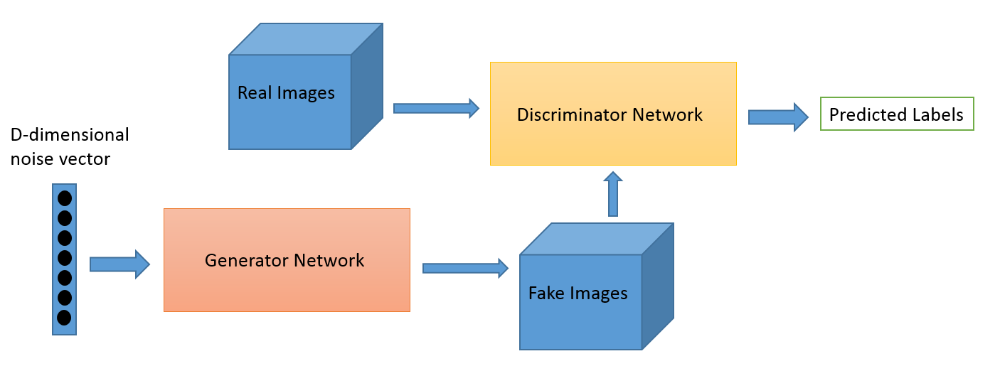

# Anime-Generator
A Pytorch implementation of Deep Convolutional Generative adverserial network (DCGAN) to generate anime faces.
The model generates anime faces from random noise given as input.

# Model Architecture
GANs are a self-supervised approach used to train generative models by using two sub-models: a Generator and a Discriminator. 
The generator is trained to generate new images while the discriminator tries to 
classify the images as either real (from the domain) or fake (generated). The models are trained together in a zero-sum 
game until the discriminator can no longer tell apart the real and generated images.  
 
The architecture follows the is DCGAN paper. However, two additional CNN layers have been added after the final layer to mitigate the checkerboard artifects caused by transpose convolutions.

### Generator
The generator takes in a 100 dimensional noise vector sampled from a normal distribution of zero mean and unit variance N(0,1).
It produces an image of size (64,64,3) with pixel values of the range [-1,1].

# Dataset 
The dataset is available [here](https://www.kaggle.com/soumikrakshit/anime-faces) on Kaggle. The dataset consists of 21551 anime faces that were obtained from www.getchu.com using a face
detector based on [this repo](https://github.com/nagadomi/lbpcascade_animeface).
The dataset contains images of size 64 by 64 pixels.

   

  
